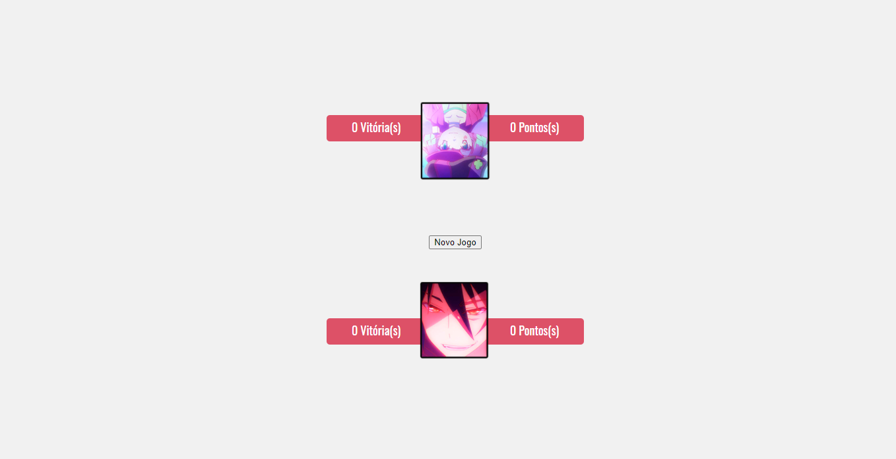

# Sete e Meio - Versão Clássica

> Um simples Jogo de Cartas feito em Javascript, que desenvolvi em 2017 e decidi tornar público a fim de registrar minha evolução aos logos dos anos.

![html-image]
![css-image]
![javascript-image]

Depois de muito tempo resolvi colocar em meu perfil do GitHub esse projeto que desenvolvi já faz uns anos, para que eu possa deixar registrado em algum lugar o quanto evolui desde que comecei a estudar programação em 2016.



## 🃏 Sobre o Jogo

Sete e Meio é um jogo de Cartas que deve ser jogado com pelo menos 2 jogadores.

O objetivo do Jogo é conseguir marcar 7,5 Pontos. Ganha o Jogador que somar o número mais próximo de 7,5 ou exatamente 7,5.

Para mais informações sobre como jogar e ver as regras completas [clique aqui](https://pt.wikipedia.org/wiki/Sette_e_mezzo).

## 🚀 Testando o Jogo

Para testar o Jogo basta apenas clonar ou baixar este repositório em sua máquina e abrir o arquivo index.html na raiz do projeto:

Clonando o Repositório:

```
git clone https://github.com/YamiRenato/sete-meio-classic-version.git
```

## ❕ Importante

Tenho total ciência de que meu código está longe de ser o mais funcional ou o mais bem organizado, mas mesmo assim quis colocar meu projeto no meu Perfil do GitHub.

Esse foi um dos primeiros projetos que desenvolvi totalmente sozinho e tenho muito orgulho dele e por isso quero deixa-lo guardado no meu GitHub, para que fique documentado meu progresso ao longo dos anos.

_Então leve isso em consideração quando avaliar o código, pois eu era iniciante na época em questão :D_

## 📱 Minhas Redes Sociais

Linkedin: [@yamirenato](https://www.linkedin.com/in/yamirenato/) – renatog.gonalves9@gmail.com

[html-image]: https://img.shields.io/badge/-html-orange
[css-image]: https://img.shields.io/badge/-css-blue
[javascript-image]: https://img.shields.io/badge/-javascript-yellow
